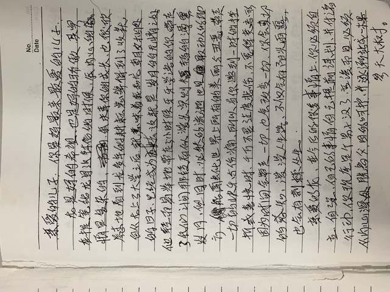
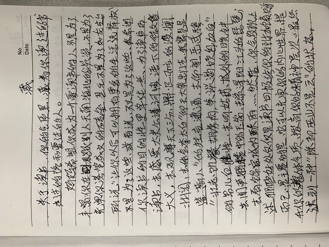
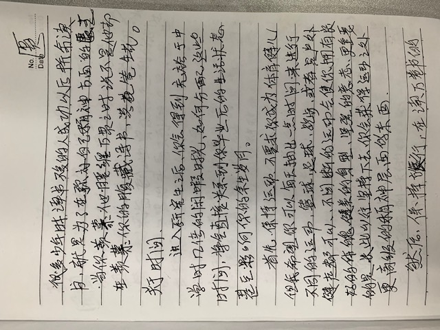
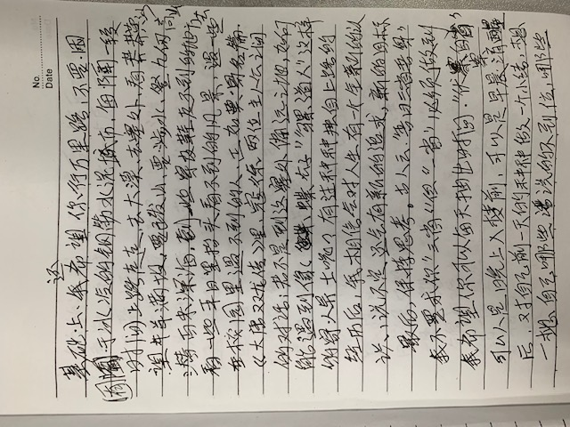
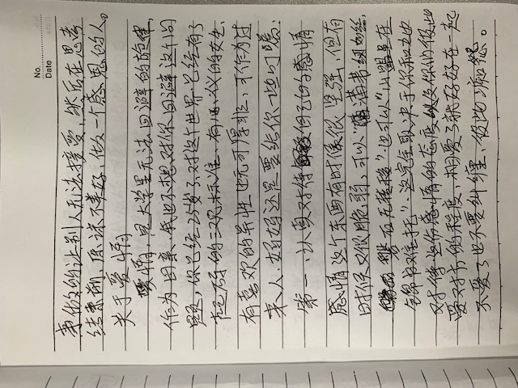
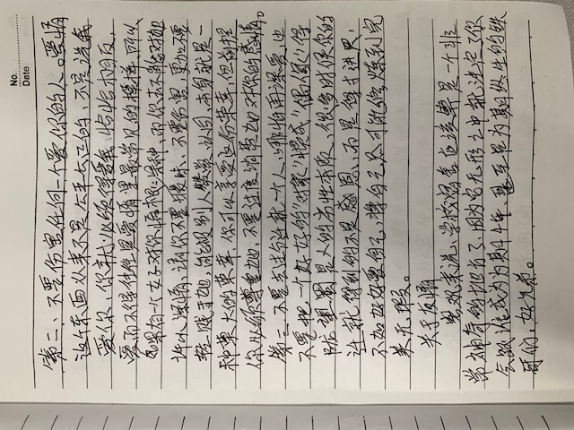
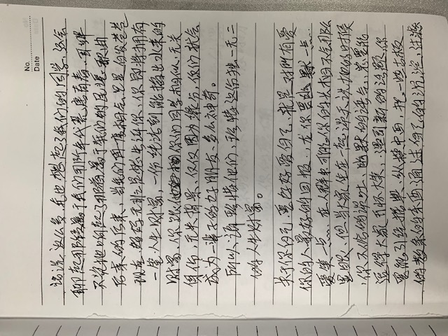
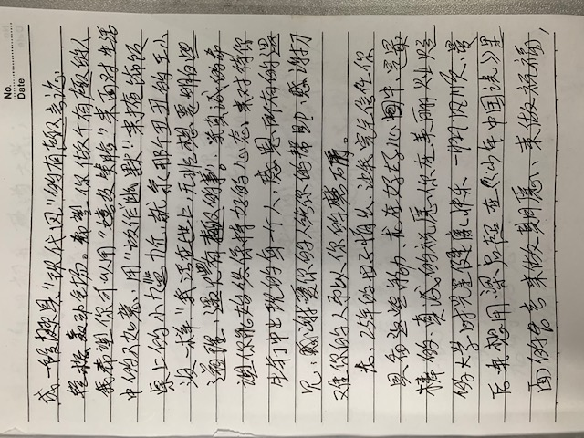
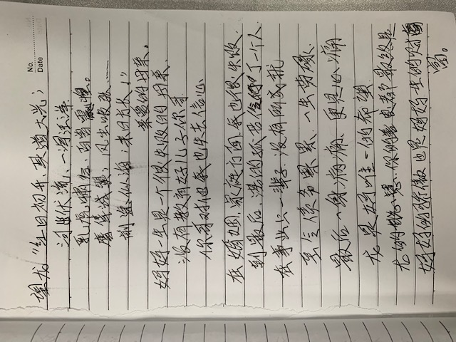

# 妈妈给我的信

亲爱的儿子，你是妈最爱的儿子。
龙是妈的希望，也是妈的骄傲。其实在提笔给龙写这封信的时候，我内心的感情是复杂的，我庆幸你的成长，也很欣慰的看到龙多年的耕耘总算得到了收获，自从龙上了大学之后，就意味着我和龙朝夕相处的日子已经成为过去，这就是对越的无情之处，它轻易的带走了小时候牙牙学语的你，带走了我们之间那段看似漫长实则短暂的漂雾岁月，但同时，必然的流逝也是最动人的地方，你能融化世界上所有的美丽与丑恶，带走一切的快乐与伤痛......
 
 
......
关于时间。进入研究生之后，你会得到充裕于中学几倍的闲暇时光，如何分配这些时间，将会直接关系到你毕业后的生活状态，甚至影响你的余生岁月。......
 
 
.......
望龙
> 红日初开，其道大光
> 河出伏流，一得汪洋
> 乳虎啸谷，百兽震惶
> 前途似海，末日方长

亲爱的母亲

妈妈一生是一个很失败的母亲，没有教育好儿子你哥，你哥对他我也失去信心
在婚姻、家庭方面，我也很失败，到最后，落得孤苦伶仃一个人，在事业上一辈子没有所成就
至令债务累累，一生劳碌
最后一身病痛，更是心痛
龙是妈唯一的希望
龙的聪慧，你的善良都最终是妈妈的骄傲，也是妈妈一生的财富

**信件原文（其中多数摘抄，但是不乏真情实感，感谢母亲的养育之恩）**

